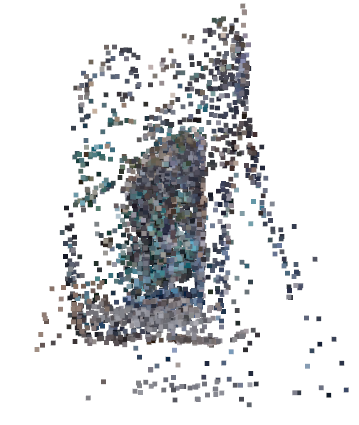

# Structure from Motion (SfM) Pipeline

A computer vision pipeline for reconstructing 3D scenes from 2D video sequences using classical Structure from Motion techniques.

<p align="center">
  
</p>
<br>Example 3D point cloud reconstruction showing a scene reconstructed from multiple camera viewpoints</br>

## Overview

This project implements a complete Structure from Motion pipeline that takes a video sequence as input and produces a 3D point cloud reconstruction of the scene. The pipeline supports multiple feature detection algorithms and provides comprehensive analysis tools for each stage of the reconstruction process.

### Key Features

- **Multiple Feature Detectors**: ORB, SIFT, FAST, Shi-Tomasi, Harris
- **Robust Geometric Estimation**: Fundamental matrix computation with RANSAC
- **Camera Pose Recovery**: Essential matrix decomposition with chirality resolution
- **3D Scene Reconstruction**: Point triangulation with bundle adjustment
- **Quality Assessment**: Comprehensive error metrics and validation
- **Visualisation Tools**: Epipolar lines, camera poses, 3D point clouds
- **Export Capabilities**: PLY point cloud format support

### Prerequisites

```bash
pip install opencv-python numpy matplotlib imageio open3d plyfile
```

### Basic Usage

```python
# Configure pipeline
VIDEO_PATH = "path/to/your/video.mp4"
NUMBER_OF_FRAME_PAIRS = 11
ALGORITHM_NAME_FUNC_MAP = {"SIFT": detect_sift}  # Choose detector

# Run Main Driver Code
```

The pipeline will automatically:

1. Extract frames from the video
2. Detect and match features
3. Estimate camera poses
4. Triangulate 3D points
5. Generate visualisation and save results

## Pipeline Stages

### 1. Frame Extraction

Extracts evenly distributed frames from input video for processing.

### 2. Feature Detection & Description

Supports multiple algorithms:

- **SIFT**: Scale-invariant, rotation-invariant
- **ORB**: Fast binary features
- **FAST**: Rapid corner detection
- **Shi-Tomasi**: Good corner detection
- **Harris**: Classic corner detector

### 3. Feature Matching & Outlier Rejection

- Lowe's ratio test for initial filtering
- RANSAC-based homography estimation for outlier removal
- Cross-validation between multiple geometric models

### 4. Fundamental Matrix Computation

- RANSAC-based estimation
- Epipolar geometry validation
- Error metric computation and visualisation

### 5. Camera Pose Estimation

- Essential matrix computation from fundamental matrix
- Automatic intrinsic parameter estimation for mobile cameras
- Chirality problem resolution via `cv2.recoverPose()`
- Pose validation and quality assessment

### 6. 3D Reconstruction

- Point triangulation using camera poses
- Optional bundle adjustment for pose refinement
- Quality analysis with reprojection error metrics
- Color extraction from source images

## Configuration

### Main Parameters

```python
# Input/Output
VIDEO_PATH = "../videos/your_video.mp4"
NUMBER_OF_FRAME_PAIRS = 11

PLOT_DETECTOR_BENCHMARK_COMPARISONS = True
PLOT_FEATURE_DETECTOR_PAIRS = True
PLOT_RANSAC_FILTERING = True
PLOT_FUNDAMENTAL_MATRIX_COMPUTATION = True
PLOT_CAMERA_POSE_ESTIMATIONS = True
VISUALIZE_3D_RECONTRUCTION = True

USE_BUNDLE_ADJUSTMENT = True

CREATE_FEATURE_MONTAGE_VIDEOS = True
```

### Algorithm Selection

```python
ALGORITHM_NAME_FUNC_MAP = {"ORB" : detect_orb,
                            "SIFT": detect_sift,
                            "FAST": detect_fast,
                            "SHI-TOMASI": detect_shi_tomasi,
                            "HARRIS": detect_harris}
```

## Output

### Generated Files

- **Point Clouds**: `reconstructions/{ALGORITHM}_reconstruction.ply`
- **Visualisations**: Interactive 3D viewer (Open3D)
- **Quality Metrics**: Console output with error analysis

### Metrics Provided

- Feature matching statistics
- Epipolar error (pixels)
- Reprojection error (pixels)
- Camera pose validation
- Bundle adjustment convergence

### Setup

```bash
git clone https://github.com/Matthew-Pirotta/Video-CV
cd structure-from-motion
pip install -r requirements.txt
```
